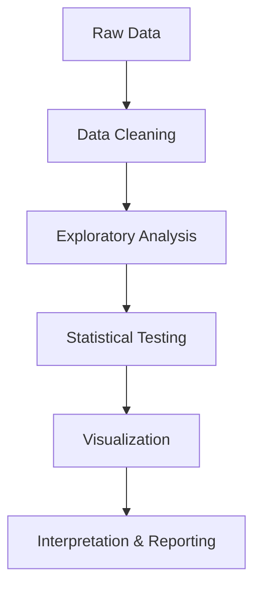

# Koala Morphological Characteristics Analysis

A comprehensive data analysis project examining morphological characteristics and demographics of Australian koalas across different habitats.

## Project Overview

This project analyzes koala physical measurements and demographics to identify biological trends and conservation indicators across Victoria and Queensland habitats.

## Dataset

- **Original Dataset**: 169 records
- **Cleaned Dataset**: 139 records
- **Features**: 14 variables including age, gender, habitat, and various physical measurements

## Analysis Workflow

1. **Data Cleaning & Standardization**
   - Handling missing values
   - Standardizing categorical data
   - Removing outliers

2. **Exploratory Data Analysis**
   - Distribution analysis
   - Correlation analysis
   - Visual exploration

3. **Statistical Analysis**
   - Hypothesis testing
   - Gender and habitat comparisons

## Key Findings

- Significant gender differences in head length (p = 0.0147)
- Average head length significantly differs from 65cm (p < 0.0001)
- No significant size difference between habitats

## Technologies Used

- Python 3.x
- pandas
- numpy
- matplotlib
- seaborn
- scipy

## Files

- `Business_Analytics.ipynb` - Main analysis notebook
- `koalas_dataset.csv` - Original raw data
- `fully_cleaned_koalas_dataset.csv` - Cleaned dataset

---

# **Knowledge Summary and Analysis Techniques**

## **Business Analytics Assignment: Koala Dataset Analysis**

## 📚 **Knowledge Domains Covered**

### **1. Data Quality & Preprocessing**
- **Missing Data Management**: Identification and removal of incomplete records using `dropna()`
- **Duplicate Detection**: Ensuring data integrity by eliminating redundant entries
- **Text Standardization**: Converting categorical values to lowercase and removing whitespace for consistency
- **Categorical Mapping**: Standardizing inconsistent category labels (e.g., 'vic'→'victoria', 'qld'→'queensland')
- **Data Type Validation**: Ensuring appropriate data types for numerical and categorical variables

### **2. Exploratory Data Analysis (EDA)**
- **Descriptive Statistics**: Understanding central tendency, dispersion, and distribution shape
- **Univariate Analysis**: Examining individual variable distributions through histograms and KDE plots
- **Bivariate Analysis**: Exploring relationships between two variables using scatter plots and box plots
- **Categorical Distribution**: Analyzing frequency distributions across categories (gender, habitat)
- **Correlation Analysis**: Identifying linear relationships between morphological measurements

### **3. Statistical Inference**
- **Parametric Tests**: 
  - Independent samples t-test for comparing means between two groups
  - Welch's t-test for groups with unequal variances
- **Non-parametric Tests**:
  - Wilcoxon signed-rank test for single-sample location testing
  - Mann-Whitney U test for comparing distributions between independent groups
- **Hypothesis Testing Framework**: Formulating null/alternative hypotheses, significance level (α=0.05), p-value interpretation
- **Effect Size Consideration**: Understanding correlation coefficients (Pearson's r)

### **4. Data Visualization Principles**
- **Comparative Visualization**: Box plots and violin plots for group comparisons
- **Distribution Visualization**: Histograms with kernel density estimates
- **Relationship Visualization**: Scatter plots with regression lines, pair plots
- **Correlation Visualization**: Heatmaps for correlation matrices
- **Multi-dimensional Visualization**: Using color (hue) to represent additional categorical variables


## 🛠️ **Analytical Techniques Applied**

### **A. Data Preparation Techniques**

| Technique | Purpose | Implementation |
|-----------|---------|----------------|
| **NA Removal** | Ensure complete cases | `df.dropna()` |
| **Deduplication** | Remove redundant records | `df.drop_duplicates()` |
| **String Normalization** | Standardize text data | `.str.lower().str.strip()` |
| **Value Mapping** | Consolidate categories | `.replace(mapping_dict)` |

### **B. Statistical Testing Strategy**

#### **Question 1: One-Sample Location Test**
- **Objective**: Test if median head length differs from 65cm
- **Method**: Wilcoxon Signed-Rank Test (non-parametric)
- **Rationale**: Appropriate when distribution normality is uncertain
- **Result**: p = 0.0000 → Reject H₀ (head length ≠ 65cm)

#### **Question 2: Two-Independent-Samples Test (Non-parametric)**
- **Objective**: Compare head length between genders
- **Method**: Mann-Whitney U Test
- **Rationale**: Non-parametric alternative to t-test for ordinal or non-normal data
- **Result**: p = 0.0147 → Significant gender difference exists

#### **Question 3: Two-Independent-Samples Test (Parametric)**
- **Objective**: Compare paw size between genders
- **Method**: Independent samples t-test
- **Rationale**: Assumes normal distribution and homogeneity of variance
- **Result**: p = 0.0738 → No significant difference (marginal)

#### **Question 4: Two-Independent-Samples Test with Unequal Variance**
- **Objective**: Compare total length between habitats
- **Method**: Welch's t-test (`equal_var=False`)
- **Rationale**: Robust to unequal variances between groups
- **Result**: p = 0.5708 → No habitat-based size difference

#### **Questions 6-7: Correlation Analysis**
- **Objective**: Assess linear relationships between body measurements
- **Method**: Pearson Correlation Coefficient
- **Metrics**:
  - Total Length ↔ Head Length: r = 0.16, p = 0.0565 (weak, marginally significant)
  - Total Length ↔ Foot Length: r = 0.43, p = 0.0000 (moderate, highly significant)

### **C. Visualization Techniques**

#### **Distribution Analysis**
```python
# Histogram with KDE overlay
sns.histplot(data, kde=True, bins=15)
```
- **Purpose**: Assess shape, skewness, and modality of continuous variables

#### **Group Comparisons**
```python
# Box plot for outlier detection and quartile comparison
sns.boxplot(x='category', y='measurement', data=df)

# Violin plot for distribution shape comparison
sns.violinplot(x='gender', y='Paw Size', inner='quartile')
```
- **Box Plot**: Shows median, IQR, and outliers
- **Violin Plot**: Combines box plot with kernel density estimation

#### **Relationship Exploration**
```python
# Scatter plot with regression line and confidence interval
sns.lmplot(x='age', y='length', hue='habitat', data=df)

# Pairwise relationships matrix
sns.pairplot(df[numerical_columns])
```
- **lmplot**: Linear regression visualization with grouping
- **pairplot**: Comprehensive view of all pairwise relationships

#### **Correlation Heatmap**
```python
sns.heatmap(corr_matrix, annot=True, cmap='coolwarm', fmt='.2f')
```
- **Purpose**: Visual identification of multicollinearity and feature relationships


## 🎯 **Key Statistical Interpretations**

### **P-value Decision Rules**
- **p < 0.01**: Very strong evidence against H₀ (highly significant)
- **0.01 ≤ p < 0.05**: Strong evidence against H₀ (significant)
- **0.05 ≤ p < 0.10**: Weak evidence against H₀ (marginally significant)
- **p ≥ 0.10**: Insufficient evidence to reject H₀

### **Correlation Strength Guidelines**
- **|r| < 0.3**: Weak correlation
- **0.3 ≤ |r| < 0.7**: Moderate correlation
- **|r| ≥ 0.7**: Strong correlation

### **Effect Size Considerations**
- Small effects may be statistically significant with large samples
- Context and domain knowledge crucial for practical significance

## 📊 **Workflow Summary**



### **Phase 1: Data Preparation**
1. Load data and inspect structure
2. Handle missing values and duplicates
3. Standardize categorical variables
4. Validate data types

### **Phase 2: Exploratory Data Analysis**
1. Generate descriptive statistics
2. Visualize distributions
3. Examine relationships
4. Identify patterns and outliers

### **Phase 3: Hypothesis Testing**
1. Formulate research questions
2. Select appropriate statistical tests
3. Calculate test statistics and p-values
4. Draw conclusions based on evidence

### **Phase 4: Communication**
1. Create informative visualizations
2. Interpret results in context
3. Document methodology and findings


## 🔬 **Best Practices Demonstrated**

1. **Reproducible Research**: Clear documentation and sequential workflow
2. **Defensive Programming**: Error handling in file operations
3. **Visual Consistency**: Standardized plot formatting and labeling
4. **Statistical Rigor**: Appropriate test selection based on data characteristics
5. **Contextual Interpretation**: Relating statistical findings to biological significance

---

## 💡 **Key Takeaways**

- **Gender dimorphism**: Significant in head length but not paw size
- **Habitat independence**: No evidence of size variation between Victoria and Queensland
- **Morphological scaling**: Moderate correlation between overall size and foot length
- **Statistical vs. Practical Significance**: Small p-values don't always indicate meaningful real-world differences

This analysis demonstrates a complete analytical pipeline from data preprocessing through statistical inference, showcasing fundamental business analytics competencies applicable across domains.