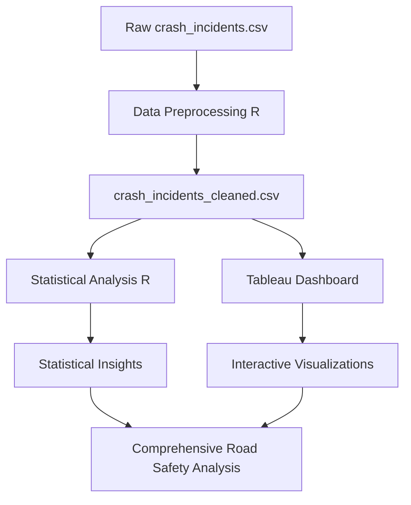

# Queensland Road Safety Analysis

**Public Safety Analytics | Data Visualization | Statistical Analysis**

A comprehensive dual-approach analysis of Queensland road safety data combining advanced statistical modeling in R with interactive visualization in Tableau. This project identifies critical safety factors, accident patterns, and provides actionable insights for road safety improvement.

## 🎯 Project Overview

This project addresses the critical public safety challenge of road traffic accidents in Queensland through data-driven analysis. By examining crash incident patterns, severity factors, and temporal trends, we provide evidence-based insights to support road safety policy and intervention strategies.

## 📊 Dataset Information

- **Source**: `crash_incidents.csv`
- **Domain**: Public Safety / Road Traffic Analysis
- **Scope**: Queensland road crash incidents with comprehensive incident details
- **Features**: Location data, crash severity, temporal information, vehicle details, road conditions
- **Output**: [`crash_incidents_cleaned.csv`](./crash_incidents_cleaned.csv) - Processed dataset ready for analysis

## 🔍 Project Objectives

1. **Primary Goal**: Identify key factors contributing to road crash severity and frequency
2. **Safety Impact**: Provide evidence-based insights for road safety interventions
3. **Pattern Recognition**: Discover temporal, geographical, and circumstantial crash patterns
4. **Policy Support**: Deliver actionable recommendations for traffic safety authorities

## 📁 Project Structure

```
Queensland Road Safety Analysis/
├── README.md                                    # Project documentation
├── Insight 1 - R Code/                         # Statistical Analysis with R
│   ├── Clean_and_Preprocess_data.R            # Comprehensive data preprocessing pipeline
│   ├── Visualization_Stage.R                  # Advanced visualization and analysis
│   ├── crash_incidents.csv                    # Raw dataset (input)
│   └── crash_incidents_cleaned.csv            # Processed dataset (output)
└── Insight 2 - Tableau/                        # Interactive Dashboard
    └── [Tableau workbooks and visualizations]
```

## 🚀 Dual-Insight Approach

### Insight 1: Statistical Analysis with R ⭐
**Comprehensive data science pipeline using R for deep statistical analysis**

#### Data Preprocessing Pipeline ([Clean_and_Preprocess_data.R](./Insight%201%20-%20R%20Code/Clean_and_%20Preprocess_data.R))
- **✅ Data Quality Assessment**: Missing value analysis and handling strategies
- **✅ Missing Value Treatment**: 
  - Numeric columns: Median imputation
  - Categorical columns: Mode imputation  
  - Columns >50% missing: Automatic removal
- **✅ Date/Time Processing**: 
  - Intelligent date parsing with multiple format detection
  - Feature extraction (year, month, day, day_of_week)
- **✅ Outlier Management**: IQR-based outlier detection and capping
- **✅ Categorical Optimization**: 
  - Reduction of high-cardinality categories (>100 unique → top 50 + "Other")
- **✅ Feature Engineering**: 
  - Vehicle age calculation (`vehicle_age_at_crash`)
  - Critical column identification and validation
- **✅ Export Pipeline**: Efficient cleaned data export for analysis

#### Advanced Visualization ([Visualization_Stage.R](./Insight%201%20-%20R%20Code/Visualization_Stage.R))
- **📊 Severity Distribution**: Pie charts showing crash severity patterns
- **📈 Time Series Analysis**: 
  - Monthly crash trends with seasonality detection
  - Day-of-week and hour-of-day pattern analysis
- **🗺️ Geospatial Mapping**: Interactive leaflet maps with severity-coded incidents
- **📋 Multi-dimensional Analysis**: 
  - Severity by time periods (hourly, daily, seasonal)
  - Roadway feature impact analysis
  - Stacked and proportional visualizations

### Insight 2: Interactive Dashboard with Tableau
**Business intelligence approach with interactive visualizations for stakeholder engagement**

## 🛠️ Technical Implementation

### R-Based Analysis Stack
| **Component** | **Technology** | **Purpose** |
|---------------|----------------|-------------|
| **Data Processing** | data.table, dplyr | High-performance data manipulation |
| **Date Handling** | lubridate | Intelligent date parsing and feature extraction |
| **Visualization** | ggplot2, leaflet | Statistical plots and interactive maps |
| **Statistical Analysis** | DescTools, R.utils | Advanced statistical computations |

### Key Features of Data Processing
1. **Robust Date Parsing**: Handles multiple date formats automatically
2. **Smart Outlier Detection**: IQR-based method with configurable thresholds
3. **Category Management**: Automatic handling of high-cardinality categorical variables
4. **Feature Engineering**: Domain-specific feature creation (vehicle age, temporal features)
5. **Data Validation**: Comprehensive quality checks and critical column validation

## 📈 Key Analytical Findings

### Data Quality Achievements
- **✅ Comprehensive Cleaning**: Systematic handling of missing values and outliers
- **📊 Feature Optimization**: Enhanced dataset with engineered temporal and domain-specific features
- **🎯 Quality Validation**: Critical column identification ensuring data integrity
- **📋 Export Ready**: Clean, analysis-ready dataset for both R and Tableau workflows

### Visualization Insights
- **Severity Patterns**: Clear identification of crash severity distributions
- **Temporal Trends**: Discovery of seasonal, weekly, and hourly crash patterns
- **Geographic Hotspots**: Spatial clustering of high-severity incidents
- **Risk Factors**: Correlation between roadway features and crash outcomes

## 📊 Business Impact

This project demonstrates capability to:
- **Transform Complex Safety Data**: Process large-scale incident datasets into actionable insights
- **Multi-Tool Proficiency**: Leverage both R statistical computing and Tableau visualization
- **Public Safety Focus**: Address real-world safety challenges with data-driven approaches
- **Stakeholder Communication**: Create both technical analysis and business-friendly dashboards

## 🔧 How to Use

### R Analysis Workflow
1. **Data Preprocessing**: Run [`Clean_and_Preprocess_data.R`](./Insight%201%20-%20R%20Code/Clean_and_%20Preprocess_data.R)
   ```r
   # Processes raw crash_incidents.csv
   # Outputs: crash_incidents_cleaned.csv
   ```

2. **Visualization Analysis**: Execute [`Visualization_Stage.R`](./Insight%201%20-%20R%20Code/Visualization_Stage.R)
   ```r
   # Generates comprehensive visualizations
   # Creates interactive maps and statistical plots
   ```

### Tableau Dashboard
1. **Access**: Open Tableau workbooks in [`Insight 2 - Tableau/`](./Insight%202%20-%20Tableau/)
2. **Interact**: Explore interactive dashboards and filters
3. **Export**: Generate reports and insights for stakeholders

## 🔄 Technical Workflow



## 🎯 Key Performance Indicators

- **Data Processing Efficiency**: Large dataset processing with optimized R pipeline
- **Visualization Coverage**: 5+ distinct visualization types covering temporal, spatial, and categorical analysis
- **Tool Integration**: Seamless workflow between R statistical analysis and Tableau business intelligence
- **Insight Depth**: Multi-dimensional analysis covering severity, location, time, and contributing factors

## 🔄 Future Enhancements

1. **Real-time Integration**: Connect with live traffic incident feeds
2. **Predictive Modeling**: Develop crash risk prediction algorithms
3. **Machine Learning**: Implement clustering and classification models
4. **Advanced Geospatial**: Integrate with road network and traffic data
5. **Mobile Dashboard**: Create mobile-friendly visualization interfaces

---

**Part of**: [Data Science & Analytics Portfolio](../README.md)

**Technologies**: R, Tableau, Statistical Analysis, Geospatial Visualization, Public Safety Analytics

**Industry**: Public Safety, Transportation, Government Analytics